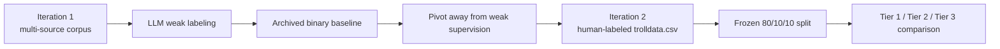
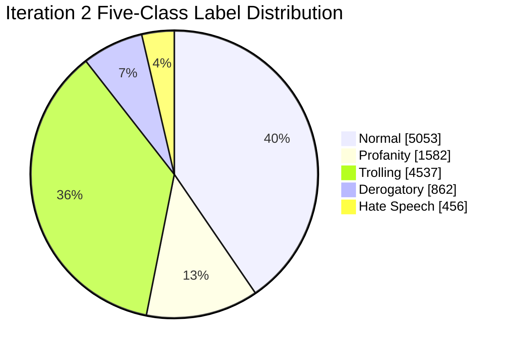
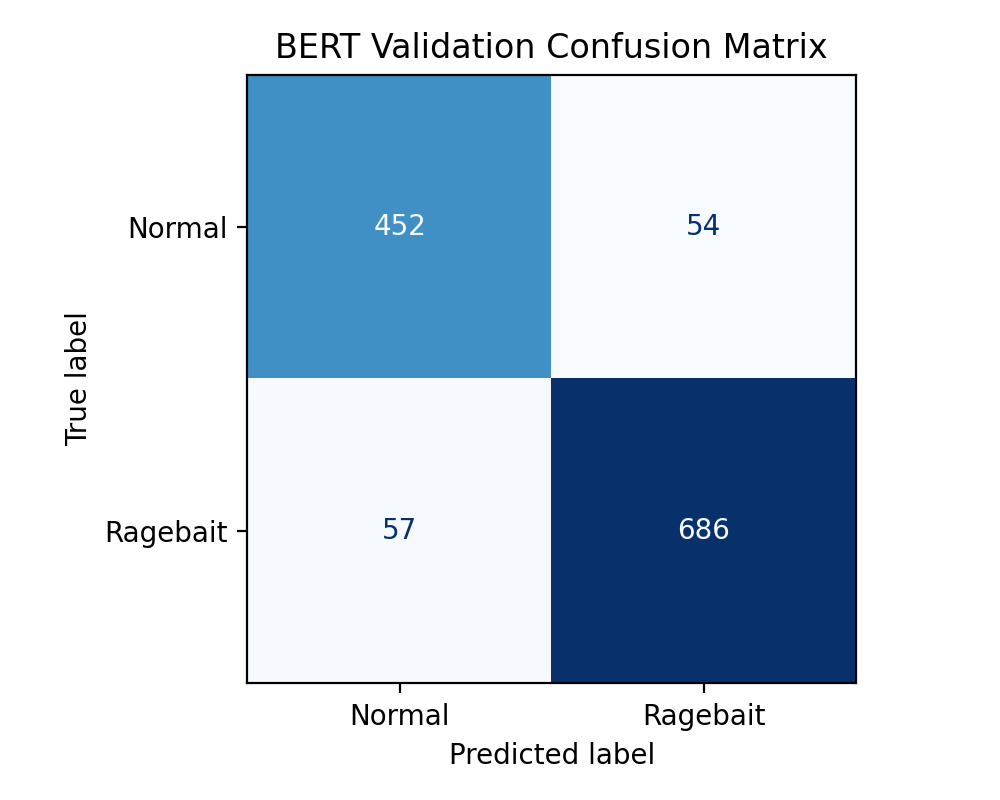
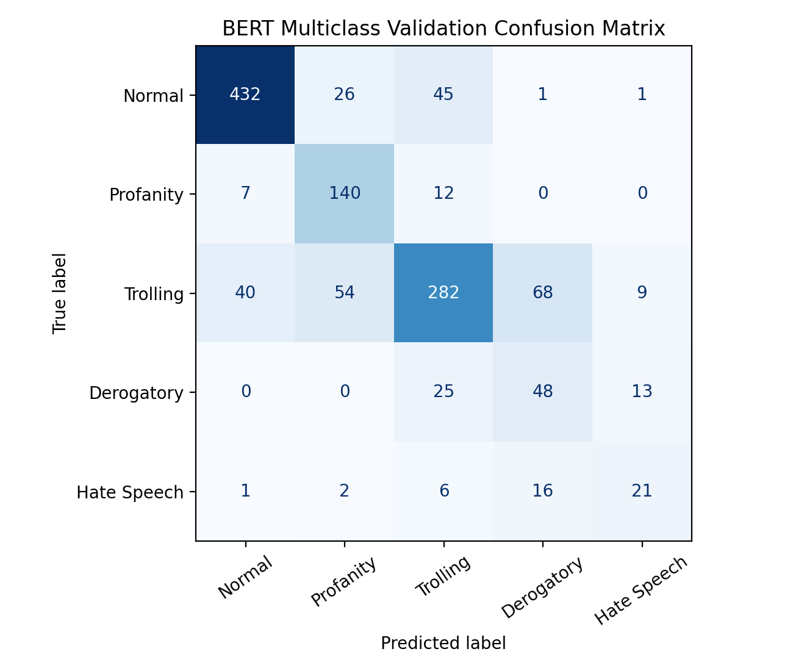

# Ragebait Detection

**CS4375 Final Project - Group 8**  
Edison Cheah, Giuseppe Galiazzi, Lawson Herger, Andrew Lin  
Repository: https://github.com/giuseppegaliazzitx-bit/ML-Project-Ragebait

This project evolved from an archived weak-label baseline into a final gold-label benchmark for abusive and rage-inducing online language.

-----

## Motivation And Project Arc
### TODO: add existing motivation and explain slides
- Goal: detect rage-inducing or abusive language in short social-media posts.
- Core research question: when do contextual transformers justify their cost over strong lexical baselines?
- The main scientific finding is not only that BERT performs best, but that label quality changed the project's validity.

-----

## Data Overview

| Phase | Source | Rows | Labels | Role |
| :--- | :--- | ---: | :--- | :--- |
| Iteration 1 | Unified 8-source corpus | 507,682 | Weak binary labels | Historical baseline |
| Iteration 2 | `iteration2/data/raw/trolldata.csv` | 12,490 | Human 5-class labels | Final benchmark |

- Binary mapping: `Normal -> 0`; all other labels -> `1`.
- Multiclass mapping: `Normal`, `Profanity`, `Trolling`, `Derogatory`, `Hate Speech`.

-----

## Task Setup And Experimental Protocol

- All Iteration 2 models use one frozen stratified `80/10/10` split.
- Binary experiments report accuracy, precision, recall, and F1.
- Multiclass experiments report accuracy, micro F1, macro F1, weighted F1, and class-wise metrics.
- Multiclass training uses inverse-frequency class weights; the largest weights are on `Hate Speech` (`5.4751`) and `Derogatory` (`2.8962`).

| Split | Rows | Binary Label 0 | Binary Label 1 |
| :--- | ---: | ---: | ---: |
| Train | 9,992 | 4,042 | 5,950 |
| Validation | 1,249 | 506 | 743 |
| Test | 1,249 | 505 | 744 |

-----

## Model Ladder

| Tier | Models | Representation | Why It Matters |
| :--- | :--- | :--- | :--- |
| 1 | Logistic Regression, Linear SVC | TF-IDF with 1-2 grams, `max_features=20000` | Strong and cheap lexical baselines |
| 2 | FFNN | Train-only embeddings + mean pooling | Lightweight neural baseline |
| 3 | BERT | Fine-tuned `bert-base-uncased` | Contextual modeling for subtle intent |

- The FFNN is more expressive than TF-IDF, but average pooling still discards word order and long-range context.
- BERT uses standard fine-tuning with AdamW, warmup/decay scheduling, gradient clipping, and dynamic padding.
- The project saves split manifests, label maps, checkpoints, confusion matrices, histories, and JSON summaries for reproducibility.

-----

## Why Iteration 1 Was Not Enough

| Stage | Rows | Positive Share |
| :--- | ---: | ---: |
| Unified unlabeled corpus | 507,682 | n/a |
| Weak-labeled corpus | 507,682 | 6.12% |
| High-confidence pool (`>= 0.95`) | 102,104 | 12.68% |
| Final balanced train file | 32,000 | 40.00% |

| Archived Model | Accuracy | Macro F1 | Takeaway |
| :--- | ---: | ---: | :--- |
| Raw-text linear SVC | 0.8744 | 0.8706 | Strong lexical baseline |
| Tuned BERT | 0.8767 | 0.8735 | Only a slight gain |

- The issue was not just model quality.
- Iteration 1 evaluated agreement with LLM-generated labels, so strong scores still did not establish scientific validity.
- That realization drove the pivot to the gold-label benchmark in Iteration 2.

-----

## Experiment 1: Binary Classification

| Model | Tier | Accuracy | Precision | Recall | F1 |
| :--- | :--- | ---: | ---: | ---: | ---: |
| Logistic Regression | 1 | 0.8551 | 0.8371 | 0.9395 | 0.8854 |
| Linear SVC | 1 | 0.8655 | 0.8780 | 0.8992 | 0.8884 |
| FFNN | 2 | 0.8671 | 0.8734 | 0.9086 | 0.8906 |
| **BERT** | **3** | **0.9079** | **0.9210** | **0.9247** | **0.9229** |

- Binary detection is already fairly easy for lexical methods, which makes the baseline comparison important.
- BERT still delivers a real held-out gain: `+0.0323` F1 over FFNN and `+0.0345` over Linear SVC.

-----

## Experiment 2: Multiclass Classification

| Model | Tier | Accuracy | Micro F1 | Macro F1 |
| :--- | :--- | ---: | ---: | ---: |
| Logistic Regression | 1 | 0.6645 | 0.6645 | 0.5524 |
| Linear SVC | 1 | 0.6797 | 0.6797 | 0.5403 |
| FFNN | 2 | 0.6373 | 0.6373 | 0.5101 |
| **BERT** | **3** | **0.7390** | **0.7390** | **0.6405** |

- The five-class task is much harder than the binary task.
- BERT's `0.6405` macro F1 is `+0.0881` above the best non-transformer baseline.
- This is the clearest evidence that contextual modeling matters once categories overlap semantically.

-----

## Class-Wise Gains And Confusion Structure

| Class | Logistic Regression F1 | BERT F1 |
| :--- | ---: | ---: |
| Normal | 0.8215 | 0.8772 |
| Profanity | 0.6108 | 0.7349 |
| Trolling | 0.6202 | 0.6853 |
| Derogatory | 0.3398 | 0.4384 |
| Hate Speech | 0.3696 | 0.4667 |

| Dominant Confusion Pair | Symmetric Errors |
| :--- | ---: |
| `Derogatory <-> Trolling` | 93 |
| `Normal <-> Trolling` | 85 |
| `Profanity <-> Trolling` | 66 |
| `Normal <-> Profanity` | 33 |
| `Derogatory <-> Hate Speech` | 29 |

-----

## Error Analysis

- Examples below are lightly redacted for presentation.
- Highest-confidence semantic miss: `Hate Speech -> Profanity` on `"get [expletive] cancer"`; the model sees profanity but underestimates the wish of harm.
- Common boundary miss: `Trolling -> Derogatory` on short insult-heavy posts; surface hostility obscures the pragmatic distinction.
- Reverse miss: `Derogatory -> Trolling` when taunting style softens clearly targeted abuse.
- The hardest BERT errors are not mainly an OOV problem.

| OOV Metric | Value |
| :--- | ---: |
| Overall multiclass test OOV rate | 7.83% |
| Mean document OOV rate on test set | 8.56% |
| Hard-error subset OOV rate | 7.61% |
| Mean document OOV rate on hard errors | 8.74% |

- Conclusion: the remaining failures are mostly semantic overlap and annotation-boundary errors, especially around `Trolling`, `Derogatory`, and milder hate content.

-----

## Speed And Deployment Tradeoff

| Model | Binary Train (s) | Binary Predict (s) | Multiclass Train (s) | Multiclass Predict (s) |
| :--- | ---: | ---: | ---: | ---: |
| Logistic Regression | 0.05 | 0.0004 | 16.31 | 0.0010 |
| Linear SVC | 0.03 | 0.0005 | 0.47 | 0.0015 |
| FFNN | 25.39 | 0.0197 | 87.86 | 0.1501 |
| BERT | 4893.59 | 64.87 | 376.79 | 9.86 |

- TF-IDF models are effectively free to train and serve.
- FFNN is still cheap, but it does not buy much over the best lexical baseline.
- BERT is the only model with a serious compute cost, but GPU training keeps the multiclass run practical at roughly 6.3 minutes.

-----

## Final Takeaways

- Classical baselines are strong enough that they must be reported, especially for the binary task.
- Weak-label pipelines are useful engineering exercises, but they are a weak endpoint for final scientific claims.
- BERT is the only model in this project that consistently improves both aggregate results and class-wise robustness.
- The hardest unresolved challenge is semantic overlap at the `Trolling`, `Derogatory`, and `Hate Speech` boundaries.
- Best next steps: grouped splits by author/source, richer context beyond one post, and sharper annotation guidance for borderline categories.

-----

## References

- *Trawling for Trolling: A Dataset*. arXiv:2008.00525.
- Devlin, Chang, Lee, and Toutanova. *BERT: Pre-training of Deep Bidirectional Transformers for Language Understanding*. NAACL-HLT, 2019.
- Pedregosa et al. *Scikit-learn: Machine Learning in Python*. JMLR, 2011.
- Project repository: https://github.com/giuseppegaliazzitx-bit/ML-Project-Ragebait
